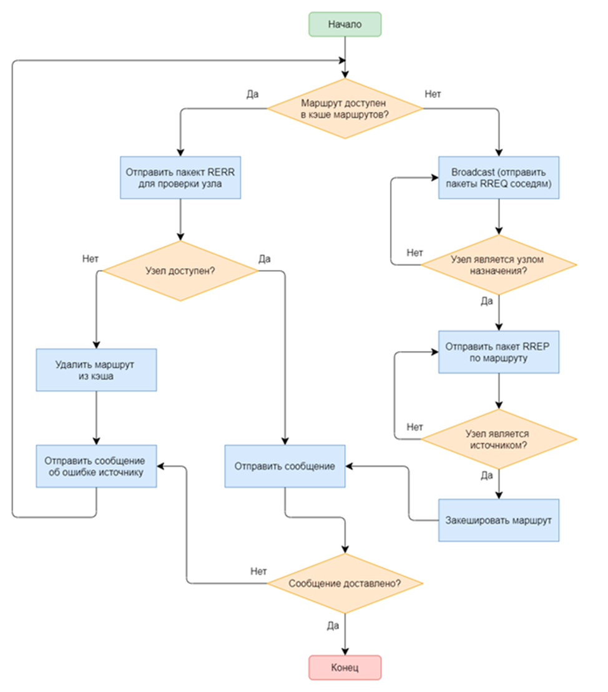
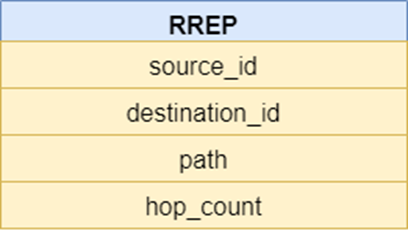

# Протокол маршрутизации DSR

## демо (как обычно, av1, только через vlc)
[https://disk.yandex.ru/d/KZwDzRq-IYk5Kw](https://disk.yandex.ru/d/KZwDzRq-IYk5Kw)

## задача
реализовать маршрутизацию DSR.






Если узел получает пакет RREQ и у него есть действующий маршрут к требуемой точке, тогда он направляет ответный пакет маршрута (RREP) узлу-соседу, приславшему RREQ. Промежуточные узлы передают первый RREP источнику, используя закэшированные записи из поля path. Кэшированные обратные пути будут уничтожены на узлах, которые не получили пакета RREP. В случае, когда узел-источник имеет маршрут к узлу назначения, он отправляет сообщение этому узлу. Обнаружив отказ одного из узлов в маршруте, предыдущий (ближе к источнику) узел посылает сообщения об ошибке маршрута (RERR – Route Error). Структура пакета RERR совпадает со структурой пакета RREP. При обнаружении ошибки поле hop_count заполняется отрицательным числом.

## реализация
общая структура взята из [https://github.com/ressiwage/wave-algorithms-finn-and-echo.git](предыдущей лабы). Были убраны алгоритмы финн и эхо.

## изменения
- пакеты сериализуются в backend/utils.py в сырые байты. Структура пакета RREQ:
```
0-4 header
4-6 broadcast id
6-8 length of source id (losi)
8-(8+losi) source id, bytes
(8+losi)-(10+losi) length of destination id (lodi)
(10+losi)-(10+losi+lodi) destination id, bytes 
(10+losi+lodi = ps)-(ps+2) path len (plt)
(2+ps)-(4+ps) path[0] len (pl[0])
(4+ps)-(4+ps+pl[0] = pe[0]) path[0]
(pe[0])-(pe[0]+2) path[1] len(pl[1])
(pe[0]+2)-(pe[0]+2+pl[1]) path[1]
...
(pe[-1])-(pe[-1]+2) hop_count
```
- для всех пакетов структура общая. сериализатор корректно упаковывает данные
- маршрутизация проводится в backend/unit.py:websocket_endpoint
- каждый n секунд с вероятностью 10% отдельный юнит захочет коммуницировать с случайным юнитом. он посылает RREQ всем родственникам
- алгоритм генерации топологии изменен на связную сеть. рандомно задаются связи в древовидной структуре.
## запуск
как обычно -- 
1. cd backend
2. pip install -r requirements.txt (желательно в venv)
    - опционально: python3 _generate_specs.py чтобы изменить топологию
3. python3 orcestrator.py
4. python3 balancer.py (в отдельном окне консоли)
5. cd ..
6. cd frontend
7. yarn
8. yarn start (в отдельном окне консоли)
9. после того как закончите можно почистить систему от зомби, выполнив  sh 'backend/KILL EVERYBODY.sh', но на свой страх и риск

---

# DSR Routing Protocol

## Demo (as usual, AV1, only through VLC)
[https://disk.yandex.ru/d/KZwDzRq-IYk5Kw](https://disk.yandex.ru/d/KZwDzRq-IYk5Kw)

## Task
Implement DSR routing.


If a node receives an RREQ packet and has a valid route to the required destination, it sends a Route Reply packet (RREP) to the neighbor node that sent the RREQ. Intermediate nodes forward the first RREP to the source using cached entries from the path field. Cached reverse paths will be removed on nodes that did not receive the RREP packet. In the case where the source node has a route to the destination node, it sends a message to that node. Upon detecting a failure of one of the nodes in the route, the previous node (closer to the source) sends a Route Error message (RERR). The structure of the RERR packet is the same as the structure of the RREP packet. When an error is detected, the hop_count field is filled with a negative number.

## Implementation
The general structure is taken from [the previous lab](https://github.com/ressiwage/wave-algorithms-finn-and-echo.git). The Finn and Echo algorithms were removed.

## Changes
- Packets are serialized into raw bytes in backend/utils.py. Structure of the RREQ packet:
```
0-4 header
4-6 broadcast id
6-8 length of source id (losi)
8-(8+losi) source id, bytes
(8+losi)-(10+losi) length of destination id (lodi)
(10+losi)-(10+losi+lodi) destination id, bytes
(10+losi+lodi = ps)-(ps+2) path len (plt)
(2+ps)-(4+ps) path[0] len (pl[0])
(4+ps)-(4+ps+pl[0] = pe[0]) path[0]
(pe[0])-(pe[0]+2) path[1] len(pl[1])
(pe[0]+2)-(pe[0]+2+pl[1]) path[1]
...
(pe[-1])-(pe[-1]+2) hop_count
```
- The structure is common for all packets. The serializer correctly packs the data.
- Routing is performed in backend/unit.py:websocket_endpoint
- Every n seconds, with a 10% probability, an individual unit will want to communicate with a random unit. It sends an RREQ to all related units.
- The topology generation algorithm has been changed to a connected network. Connections are randomly assigned in a tree structure.

## Launch
As usual --
1. cd backend
2. pip install -r requirements.txt (preferably in a venv)
    - Optional: python3 _generate_specs.py to change the topology
3. python3 orcestrator.py
4. python3 balancer.py (in a separate console window)
5. cd ..
6. cd frontend
7. yarn
8. yarn start (in a separate console window)
9. After finishing, you can clean the system of zombies by executing `sh 'backend/KILL EVERYBODY.sh'`, but at your own risk.