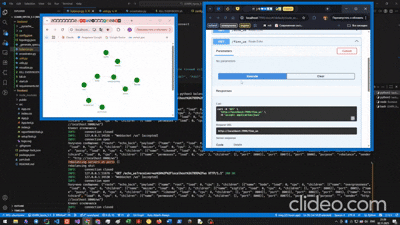

# топологические алгоритмы балансировки и распространения
english version below

live demo in bad quality (av1, play via vlc):

[https://disk.yandex.ru/d/80QYAZcCj1G3Rw](https://disk.yandex.ru/d/80QYAZcCj1G3Rw)

live demo in even worser quality:

## задача
эта работа -- лабораторная по предмету "теория и алгоритмы высокопроизводительных вычислений". суть работы -- реализовать балансировку с помощью алгоритма эха и алгоритма финна.
## о работе
в качестве предметной области выбрана эмуляция декодирования видео. каждый процесс имеет свою очередь задач и число процессоров. считается что задача нагружает ядро процессора на 100% пока не выполнится через `backend/config.json:task_time` секунд. 

Серверная структура имеет древовидную ориентированную форму и определена в `backend/topology.json` файле. при выполнении `backend/_generate_specs.py` структура меняется на другую, при том у серверов имена меняются на произвольные случайные слова (так что pussy в названиях серверов это просто совпадение). Пример ниже

Сервера реализованы на fastapi и запускаются с помощью orcestrator.py. реализован он коряво и иногда может оставлять после себя зомби, так что убить все мои процессы вы можете с помощью `backend/KILL EVERYBODY.sh`.

Сервера запускаются на портах `[8000-...)`

Кроме серверов также есть балансировщик и фронтенд. балансировщик запущен на порту 7999, фронтенд на 3000.

### Балансировщик 
лежит по пути `backend/balancer.py` и имеет следующие сценарии:
1. каждые `backend/config.json:rebalance_interval` секунд происходит балансировка всех серверов **алгоритмом эхо**
    0. балансировщик прослушивает сокетные сообщения на ws://localhost:7999/ws
    1. балансировщик отправляет своему дочернему процессу на порту 8000 json вида `{route:'echo', sender:'ws://localhost:7999/ws'}`
    2. 8000 принимает сообщение и отправляет его своим потомкам
    3. бездетные потомки отправляют сообщение `{route:'echo_back'}` по адресу sender от родителя. при этом sender сохранено в контексте приложения ввиду асинхронности сокетов
    4. балансировщик получает всю информацию через сокет и вызывает балансировку
    5. балансировщик формирует мин-кучу с ключом `-(cpu/load)`, таким образом наверху оказываются самые загруженные процессы
    6. по одному балансировщик отправляет http реквесты rebalance на самые загруженные сервера, указывая получателя из тех серверов где самый большой ресурс (cpu-load)
    7. сервер, получая реквест rebalance, убирает элемент из очереди задач, понижает себе загрузку и увеличивает её у того, кто получил его задачу
        - реквест rebalance может вернуть ошибку, это нормально. это означает что задача уже выполнилась и нет нужды в перебалансировку
2. с помощью **алгоритма финна** по роуту `/finn_ws` происходит распределение нагрузки
    1. балансировщик принимает http реквест на адрес finn_ws
    2. балансировщик отправляет через сокет на корень 8000 json вида `{'route':'finn', 'inc': [], 'ninc':[]}`
    3. сервер получает этот пакет и отправляет дальше, добавляя в inc и ninc себя т.к. все родители отправили ему сообщение.
        - также он выполняет finn_action, т.к. его ninc == inc. finn_action -- функция, добавляющая 1 задачу
    4. аналогично работают другие сервера: получают inc и ninc, конкатенируют со своими. по умолчанию их inc -- `app.state.port`, ninc -- пустой set. если они получили сообщения от вс после того как они получают сообщения от всех родителей они добавляют себе в ninc свой порт и отправляют сообщения детям, а когда inc==ninc то выполняют finn_action.
3. с помощью **алгоритма эхо** передают в фронтенд всю информацию о дереве серверов
    1. фронтенд (на порту 3000) подключается к сокету на 7999
    2. балансировщик регистрирует фронтенд и будет отправлять ему пакеты, в которых нет поля `purpose:'rebalance'` (т.к. это только для ребалансировки)
    3. раз в 5 секунд фронтенд делает http реквест на роут echo_ws балансировщика
    4. после реквеста из п. выше происходит такое же распространение как в сценарии балансировки
    5. после получения финального варианта строения дерева оно также отправляется в фронтенд и парсится в дерево. см. изображение ниже. иногда пакеты теряются и структура меняется, это не страшно

## стек
fastapi, websockets, react, pydantic, argparse, subprocess, threading, chroma-js, reagraph, treelib, random_word

## запуск
проверено на python3.12.3.
1. cd backend
2. pip install -r requirements.txt (желательно в venv)
    - опционально: python3 _generate_specs.py чтобы изменить топологию
3. python3 orcestrator.py
4. python3 balancer.py (в отдельном окне консоли)
5. cd ..
6. cd frontend
7. yarn
8. yarn start (в отдельном окне консоли)
9. после того как закончите можно почистить систему от зомби, выполнив  sh 'backend/KILL EVERYBODY.sh', но на свой страх и риск

---
# Topological Load Balancing and Propagation Algorithms

## Task

This work is a laboratory assignment for the "Theory and Algorithms of High-Performance Computing" course. The goal is to implement load balancing using the Echo algorithm and the Finn algorithm.

## About the Project

The chosen domain is video decoding emulation. Each process has its own task queue and number of processors. A task is considered to load a processor core at 100% until it completes after `backend/config.json:task_time` seconds.

The server structure has a directed tree form and is defined in the `backend/topology.json` file. When executing `backend/_generate_specs.py`, the structure changes to a different one, and server names are replaced with random words (so "pussy" in server names is just a coincidence). Example below:

Servers are implemented using FastAPI and launched via orcestrator.py. The implementation is somewhat rough and may sometimes leave zombie processes, so you can kill all my processes using `backend/KILL EVERYBODY.sh`.

Servers start on ports `[8000-...)`

In addition to servers, there is a balancer and a frontend. The balancer runs on port 7999, the frontend on port 3000.

### Balancer

Located at `backend/balancer.py` and has the following scenarios:

1. Every `backend/config.json:rebalance_interval` seconds, all servers are balanced using the **Echo algorithm**
    0. The balancer listens for WebSocket messages at ws://localhost:7999/ws
    1. The balancer sends a JSON `{route:'echo', sender:'ws://localhost:7999/ws'}` to its child process on port 8000
    2. Port 8000 receives the message and forwards it to its descendants
    3. Childless descendants send a message `{route:'echo_back'}` to the sender address from the parent. The sender is stored in the application context due to WebSocket asynchronicity
    4. The balancer receives all information via WebSocket and triggers balancing
    5. The balancer forms a min-heap with the key `-(cpu/load)`, so the most loaded processes are at the top
    6. One by one, the balancer sends HTTP rebalance requests to the most loaded servers, specifying the recipient from the servers with the most available resources (cpu-load)
    7. When a server receives a rebalance request, it removes an element from the task queue, decreases its own load, and increases the load of the server that received its task
        - The rebalance request may return an error, which is normal. This means the task has already completed and no rebalancing is needed

2. Using the **Finn algorithm** via the `/finn_ws` route for load distribution
    1. The balancer receives an HTTP request at the finn_ws address
    2. The balancer sends via WebSocket to the root (8000) a JSON like `{'route':'finn', 'inc': [], 'ninc':[]}`
    3. The server receives this packet and forwards it, adding itself to inc and ninc since all parents sent it the message.
        - It also performs finn_action since its ninc == inc. finn_action is a function that adds 1 task
    4. Other servers work similarly: they receive inc and ninc, concatenate with their own. By default, their inc is `app.state.port`, ninc is an empty set. When they receive messages from everyone after receiving messages from all parents, they add their port to ninc and send messages to children, and when inc==ninc they perform finn_action.

3. Using the **Echo algorithm** to send all information about the server tree to the frontend
    1. The frontend (on port 3000) connects to the WebSocket on 7999
    2. The balancer registers the frontend and will send it packets that don't have the field `purpose:'rebalance'` (as this is only for rebalancing)
    3. Every 5 seconds, the frontend makes an HTTP request to the balancer's echo_ws route
    4. After the request from the previous step, propagation occurs similar to the balancing scenario
    5. After receiving the final tree structure, it's also sent to the frontend and parsed into a tree. See image below. Sometimes packets are lost and the structure changes, which is not critical

## Tech Stack

FastAPI, WebSockets, React, Pydantic, argparse, subprocess, threading, chroma-js, reagraph, treelib, random_word

## Launch

Tested on Python 3.12.3.

1. cd backend
2. pip install -r requirements.txt (preferably in a venv)
    - Optional: python3 _generate_specs.py to change the topology
3. python3 orcestrator.py
4. python3 balancer.py (in a separate console window)
5. cd ..
6. cd frontend
7. yarn
8. yarn start (in a separate console window)
9. After finishing, you can clean up zombie processes by executing `sh backend/KILL EVERYBODY.sh`, but at your own risk